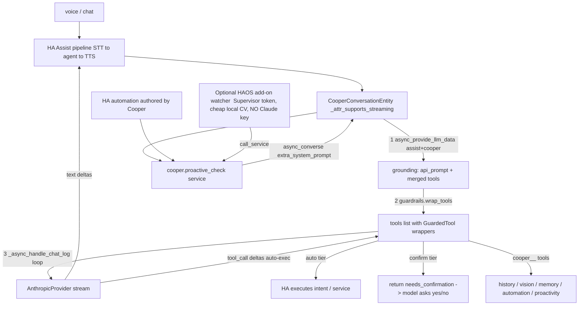
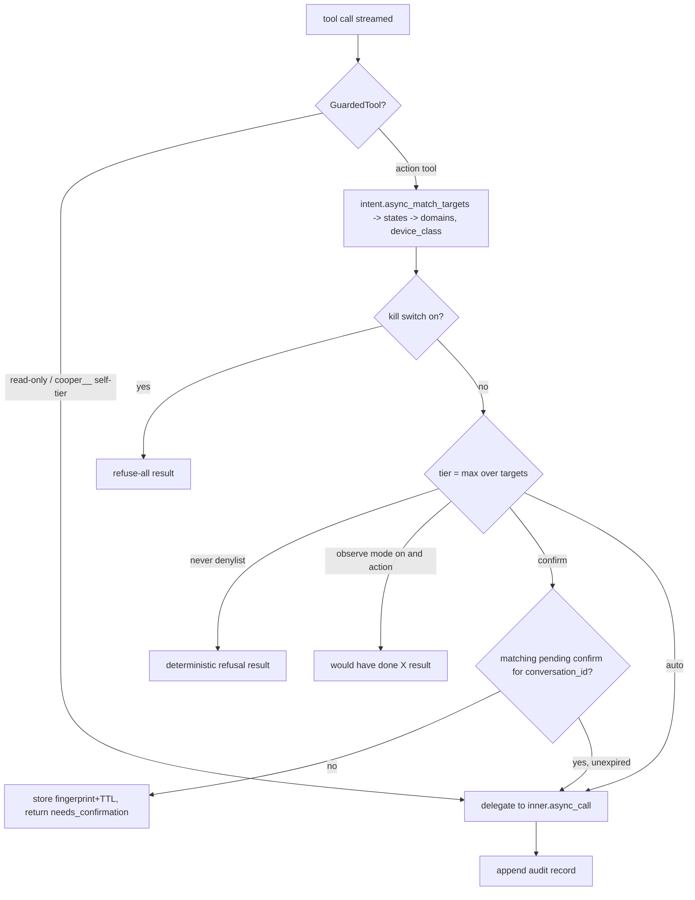

# Cooper — hardened, buildable implementation plan

## Context

`docs/PLAN.md` already sets the architecture and the four locked decisions (HACS custom
integration as the primary product on all install types + optional HAOS add-on; ground on HA's
built-in LLM Tools API + a few custom tools; v1 = agent + proactivity; BYO Anthropic key, Claude-only
behind a thin provider, prompt caching on). This pass does what the plan flagged as "verify on clone":
it checks the load-bearing HA internals against current `home-assistant/core`, resolves the design
forks those checks exposed, and turns the prose into a concrete file-by-file build with phased,
independently-installable milestones.

Two findings change the design materially and are the spine of this document:

1. **The chat-log loop auto-executes every tool call.** `ChatLog.async_add_delta_content_stream`
   fires `llm_api.async_call_tool(...)` the instant a tool-call delta streams in. So guardrails
   cannot sit "around" the loop — they must live *inside the tools*. We enforce them by **wrapping
   the tools in `chat_log.llm_api.tools` after grounding is resolved** (auto-tier already executes
   optimistically for free; we only gate confirm/never/observe).
2. **Risky domains are reached through name-slotted built-in intents, not entity-id service calls.**
   `HassTurnOff` unlocks a lock / closes a cover (one handler spans lock, cover, valve, button).
   The tool call only carries `{"name": "front door"}`, so to tier by domain we must **resolve the
   target with `intent.async_match_targets` inside the wrapper** to learn it's a `lock`. This is what
   makes the README's promise ("locks, garages require a yes/no") actually enforceable.

**Decisions from this session:** domain slug **`cooper`** (matches the repo/README); default model
**`claude-opus-4-8`** (most capable; the streaming-to-TTS + caching design hides first-audio latency,
and Sonnet/Haiku are a per-agent config toggle for installs that want snappier total completion).

**Repo is public** — see *Public-repo hygiene* below; scrub the real LAN IP and personal name shortlist
already sitting in `docs/PLAN.md`, and keep all secrets out (key lives only in HA's encrypted config
entry; the add-on uses the runtime-injected Supervisor token).

---

## Verified against home-assistant/core (commit `a21212a`, 2026-06-02)

| Claim in PLAN.md | Verdict | Evidence |
|---|---|---|
| Loop terminates on `unresponded_tool_results` | ✅ | `conversation/chat_log.py:376` → `self.content[-1].role == "tool_result"`; loop breaks at `anthropic/entity.py:1234` |
| `_async_handle_chat_log` shape (create→stream→convert→extend→break), `MAX_TOOL_ITERATIONS=10` | ✅ | `anthropic/entity.py:146,1170-1236` |
| Tool-call `id`/`external` placement | ✅ | `llm.ToolInput(id, tool_name, tool_args, external)` (`helpers/llm.py:201-208`); `external=True` → `server_tool_use` block, else `tool_use` (`anthropic/entity.py:420-457,824-847`) |
| `async_provide_llm_data` merges `[assist, custom]` cleanly | ✅ **with a caveat** | `chat_log.py:673-768` → `llm.async_get_api` → `MergedAPI` when >1 (`llm.py:148-171`). **MergedAPI namespaces every tool** as `f"{slugify(api.name)}__{tool.name}"` and prefixes each API's prompt (`llm.py:390-434,360-387`). So `HassTurnOn`→`assist__HassTurnOn`, our tools→`cooper__remember`. With a single API (`[assist]` only) there is **no** namespacing. Our code must match on the base name (`name.rsplit("__",1)[-1]`). |
| Anthropic SDK pin + model handling | ✅ | `anthropic/manifest.json` → `anthropic==0.96.0` (also in `requirements_all.txt`). Models fetched live via `client.models.list()` in the coordinator; config uses `SelectSelector(custom_value=True)`. HA's own default is `claude-haiku-4-5`. |
| Streaming delta contract our provider must emit | ✅ | `AssistantContentDeltaDict`/`ToolResultContentDeltaDict` (`chat_log.py:314-330`): `{"role":"assistant"}`, `{"content":str}`, `{"thinking_content":str}`, `{"native":Any}`, `{"tool_calls":[ToolInput]}`, and tool-result `{"role":"tool_result","tool_call_id","tool_name","tool_result"}`. Reference mapping in `anthropic/entity.py:478-882`. |
| Tools are auto-executed in the loop | ✅ | `chat_log.py:531-539` creates `async_call_tool` task per non-external tool call. |
| Built-in action reach | ✅ | `OnOffIntentHandler` (HassTurnOn/Off) spans light/switch/**cover/valve/lock(on=lock,off=unlock)/button** (`components/intent/__init__.py:180-265`); `HassClimateSetTemperature`, `HassLightSet`, media (`HassMediaPause/Next/SetVolume…`), vacuum, `HassSetPosition/StopMoving`, ScriptTool, GetLiveContext/GetDateTime/Calendar/Todo. **No `alarm_control_panel` intent exists** → alarm arm/disarm is *not* reachable via Assist. |
| Target resolution for tiering | ✅ | `intent.async_match_targets(hass, MatchTargetsConstraints(name=,area_name=,floor_name=,domains=,assistant=…))` → `MatchTargetsResult.states: list[State]` (`helpers/intent.py:309-372,511`). Gives domain + `device_class`. |
| Proactivity callback path | ✅ | `conversation.async_converse(...)` accepts `extra_system_prompt=` and routes to our entity's `_async_handle_message` (`agent_manager.py:79-118`), i.e. same loop + same wrapped tools. |
| `api_prompt` is cache-stable | ✅ | AssistAPI builds it with `include_state=False` (`llm.py:487`) — static area/device/entity overview; live values come from the `GetLiveContext` tool. So it changes only when exposure/registry changes → good cache key. |

**Could not verify here (flag for implementation):**
- Exact live availability of `claude-opus-4-8` et al. — non-blocking: the coordinator fetches the live
  list and `config_flow` already surfaces `model_not_found` for bad ids (`anthropic/config_flow.py:349`).
- `voluptuous_openapi.convert` strips `anyOf/oneOf/allOf` (`anthropic/entity.py:153-155`) → **author all
  custom-tool param schemas without those** or they silently lose constraints.
- The programmatic automation-save endpoint (we confirmed the validator *inputs*, not the write path) —
  use the `config/automation/config/{id}` WS command; verify perms in Phase 4.
- HACS repo validation + add-on multi-arch/Supervisor runtime — verify against HACS/Supervisor docs at build.

---

## Architecture (refined)



The integration is the only thing that talks to Claude, owns guardrails, and executes. The add-on and
authored automations are **trigger sources** that re-enter through `cooper.proactive_check` →
`async_converse` → the same wrapped-tool loop. There is exactly one brain.

---

## Per-turn loop, provider, and delta mapping

`conversation.py::_async_handle_message` (mirrors `anthropic/conversation.py:57-77` with two inserts):

1. `await chat_log.async_provide_llm_data(user_input.as_llm_context(DOMAIN), options.get(CONF_LLM_HASS_API, [LLM_API_ASSIST, DOMAIN]), persona_prompt, None)` — HA builds `content[0]` (persona via `user_llm_prompt` + `api_prompt` grounding) and resolves the merged tool set into `chat_log.llm_api`.
2. **`guardrails.wrap_tools(self.hass, chat_log, runtime)`** — replace entries in `chat_log.llm_api.tools` in place with `GuardedTool` wrappers (read-only and self-tiering `cooper__*` tools pass through). Wrappers preserve `.name/.description/.parameters`, so the schema the model sees is unchanged and `async_call_tool` (matches by name) routes through them.
3. **stash the memory block** for `_get_model_args` (set `self._memory_block` from `memory.get_block(user_id, subentry_id)`).
4. `await self._async_handle_chat_log(chat_log)` — the vendored loop.
5. `return conversation.async_get_result_from_chat_log(user_input, chat_log)`.

**Provider (`provider/anthropic_client.py`)** — vendor (copy, attributed) HA's `AnthropicDeltaStream`,
`_convert_content`, and `_format_tool` (they are private, battle-tested, and we need to own caching +
model args). The vendored delta stream already emits the exact dict shapes verified above. Expose a thin
interface so other providers can slot in later:

```python
class LLMProvider(Protocol):
    async def validate_key() -> None
    def build_stream(self, *, system, messages, tools, model, max_tokens, cache, thinking) -> AsyncStream
    def map_stream(self, chat_log, stream) -> AsyncIterator[AssistantContentDeltaDict | ToolResultContentDeltaDict]
    async def describe_image(self, image: bytes, mime: str, question: str) -> str  # used by the vision tool
```

`_get_model_args` (in `entity.py`, adapted from `anthropic/entity.py:910-1168`): `messages =
_convert_content(chat_log.content[1:])`; `tools = [_format_tool(t, chat_log.llm_api.custom_serializer)
for t in chat_log.llm_api.tools]`; **append Anthropic's native `web_search` server tool when the
agent's web-search toggle is on** (so web search is a server tool, not a custom `llm.Tool` — removes
`tools_websearch.py` from the original tree). Set `stream=True`, `max_tokens`, `thinking` per config.

**Latency, mapped to mechanism:**
- *Time-to-first-audio:* `_attr_supports_streaming=True` + provider emits `{"content": text}` per `TextDelta` → pipeline TTS speaks sentence one while later tools still run.
- *Optimistic execution:* auto-tier needs **no special code** — the loop already starts the service call on the tool-call delta. We simply don't gate auto-tier.
- *Fast first token:* prompt cache (below).
- *Spoken progress:* persona-prompt rule ("before a slow lookup, say one short human line"), not code.
- *No needless round-trips:* persona-prompt rule to answer trivial Q&A in one stream without forcing a tool.
- *Opus default:* keep `max_tokens` modest (~1500) and `thinking` low/none for voice; document that Sonnet/Haiku are selectable per agent if total completion latency matters more than peak reasoning.

---

## Prompt caching (we own `model_args`, so we can do better than one breakpoint)

Because we build `system` ourselves, split it so the volatile part doesn't bust the big cache:

```
system = [
  { type:text, text: chat_log.content[0].content,  cache_control: ephemeral },  # persona + HA grounding (stable)
  { type:text, text: memory_block,                  cache_control: ephemeral },  # known preferences (stable within a user)
]
```

Anthropic caches `tools → system` as a prefix up to the last breakpoint, so breakpoint #1 caches **all
tool defs + persona + grounding** (the former ~8k-token-per-turn cost in v1), and #2 caches memory.
Keep memory **out** of `user_extra_system_prompt` (which HA folds into `content[0]`); inject it as the
separate block above. Config exposes `prompt_caching` (off/prompt/automatic) like upstream; default
`prompt`. When exposure changes, `api_prompt` changes and the cache recomputes — acceptable.

---

## Guardrails (`guardrails.py`) — mechanical, domain-keyed, enforced inside tools



- **Tiers** computed from resolved `State.domain` + `device_class` + on/off direction (no per-home lists):
  - *auto (reversible):* light, switch, scene, media_player, climate setpoint, fan, cover **open**, `HassLightSet`, `HassSetPosition`, scripts not flagged risky.
  - *confirm (risky):* `lock` **unlock**, cover/valve **close**, any cover with `device_class in {garage, gate}` (both directions), bulk actions over a configurable target-count threshold, automation **edit/delete**.
  - *never (denylist, configurable):* `homeassistant.stop`, `hassio.*`, `update.*` installs, config/host ops → deterministic refusal.
  - *not reachable:* `alarm_control_panel` (no Assist intent) → documented limitation; a user may expose a script to wrap it (script edits/deletes are confirm-tier).
- **Confirm without mutable schemas:** built-in intent schemas are fixed, so we can't add a `confirmed` arg. Instead keep `runtime.pending_confirmations[conversation_id] = {fingerprint, expires}` where `fingerprint = hash(service, sorted(resolved entity_ids))`. First confirm-tier call stores the fingerprint + ~2 min TTL and returns `needs_confirmation` (the model then asks a spoken yes/no and the loop ends). On the user's "yes", the model re-issues the same action; the wrapper recomputes the same fingerprint, finds the unexpired pending entry, and executes. Mismatched/!changed actions never auto-execute.
- **Observe mode** (default **on** at onboarding): action tools return `"would have done X"` without executing; read tools run normally.
- **Kill switch:** `cooper.kill_switch` service + a runtime flag → refuse-all.
- **Audit:** every wrapped call and every `cooper__*` write logs `{ts, conversation_id, tool, base_name, resolved_targets, args, tier, decision, observe, kill, result_summary}` to a `Store`-backed ring buffer + `LOGGER` + an HA event `cooper_tool_executed` for dashboards.
- **Base-name helper:** `base_name(t) = t.name.rsplit("__", 1)[-1]` so wrapping works whether or not `MergedAPI` namespaced the tool.

---

## Deterministic automation validator (`validation.py`)

Pure, reused by `tools_automation` and `tools_proactivity`. Given a candidate automation/script dict:
1. every `entity_id` exists (`hass.states.get`), every `service`/action exists (`hass.services.has_service(domain, service)`), every `area_id`/`floor_id` exists (area/floor registries).
2. structure validates against the automation component's voluptuous schema (`homeassistant.components.automation.config` validators) — triggers/conditions/actions well-formed.
3. returns `(ok, normalized_dict, [structured_errors])`; on failure the tool returns the errors verbatim so the model can self-correct in the next iteration.
4. on save: stamp a stable `id` prefixed `cooper_<ulid>` and add a label/category so authored automations are auditable and bulk-removable; write via the `config/automation/config/{id}` WS command (verify in Phase 4), then it lives as a native HA automation surviving restarts.

---

## Proactivity (portable, all install types)

`cooper.proactive_check(reason, context_entities?, notify_target?, agent_id?, conversation_id?)`:
- resolves the target Cooper conversation entity (explicit `agent_id`, else the single/first one in `runtime`),
- enforces a **cooldown**: `Store`-backed `last_fired[(agent, hash(reason))]`; skip if within the per-watch min-interval (prevents runaway loops),
- calls `conversation.async_converse(hass, text=reason, conversation_id=<fresh-or-given>, context, agent_id=<entity_id>, extra_system_prompt=PROACTIVE_SEED)`. Same loop, same wrapped tools, same guardrails.
- **Delivery** (no voice satellite present): `PROACTIVE_SEED` instructs the model to stay silent if nothing's worth saying, else announce via the exposed `HassBroadcast` intent (verified *not* in `IGNORE_INTENTS`) or an exposed `notify`; if `notify_target` was supplied, the handler also forwards the final text there.

`tools_proactivity`: `create_watch` (authors an automation whose action is `cooper.proactive_check`, with a built-in throttle condition + per-watch min-interval), `list_watches`, `remove_watch` — all confirm-tier and validated through `validation.py`. This delivers full proactivity on Core/Container with **no add-on**.

---

## Integration ↔ add-on boundary (single-brain invariant)

The optional `addon/cooper_watcher/` (HAOS/Supervisor only) does what the event bus/cron can't do cheaply:
debounced/batched event watching, **cheap local** camera CV (frame-diff/motion; optional tiny local model
— *no Anthropic key in the add-on*), and scheduled reasoning triggers. When a signal clears its local
threshold it calls `cooper.proactive_check` via the HA WS API using the runtime `SUPERVISOR_TOKEN`. So all
Claude calls, guardrails, exposure, and audit stay in the integration.

**Pressure-test result:** a Supervisor-token client *could* technically call `homeassistant.turn_on`
directly — there is no hard sandbox. The invariant is enforced by convention + code review (first-party,
same repo), not by a permission boundary. This is acceptable for v1 and is documented; the add-on ships
calling only `cooper.proactive_check`.

---

## Config & onboarding (`config_flow.py`, mirrors `anthropic/config_flow.py`)

- `async_step_user`: API key → `validate_input` via `client.models.list(timeout=10)` → create entry titled "Cooper" with one default `conversation` subentry: `{CONF_RECOMMENDED:True, CONF_LLM_HASS_API:[LLM_API_ASSIST, DOMAIN], CONF_PROMPT: COOPER_PERSONA_PROMPT, CONF_OBSERVE_MODE:True, CONF_PROACTIVITY:True}`.
- `ConversationSubentryFlowHandler` (init → advanced → model): name; persona prompt (`TemplateSelector`); `CONF_LLM_HASS_API` multiselect (default `[assist, cooper]`); recommended bool; advanced adds model (`SelectSelector(options=coordinator.data, custom_value=True)`, default `claude-opus-4-8`), `prompt_caching`, `max_tokens`, `thinking`, `web_search` toggle, `observe_mode` default, `proactivity` toggle.
- **Registration ordering gotcha:** our `cooper` LLM API must be registered (`llm.async_register_api`) *before* the subentry flow lists APIs (`llm.async_get_apis`). Register it in `async_setup_entry` (idempotent guard), not lazily, so it shows up in the picker; unregister on unload.
- Custom tools fetch provider/guardrail-state/memory from `hass.data[DOMAIN]` via a `get_runtime(hass)` accessor, since `llm.Tool.async_call` only receives `(hass, tool_input, llm_context)`.

---

## File-by-file plan

```
/                      hacs.json  repository.yaml  README.md  info.md  LICENSE  .gitignore
.github/workflows/     validate.yml (hassfest + HACS validation + add-on lint + multi-arch build)
custom_components/cooper/
  manifest.json        domain "cooper", name "Cooper", dependencies ["conversation"],
                       after_dependencies ["assist_pipeline","intent","recorder","camera"],
                       requirements ["anthropic==0.96.0"], integration_type "service",
                       iot_class "cloud_polling", config_flow true, codeowners/documentation/issue_tracker/version
  const.py             DOMAIN, CONF_*, DEFAULT (chat_model=claude-opus-4-8, max_tokens, prompt_caching=prompt,
                       observe_mode=True, proactivity=True), TIER tables + denylist, COOPER_PERSONA_PROMPT, PROACTIVE_SEED
  __init__.py          setup_entry: build coordinator+client, store runtime in hass.data[DOMAIN],
                       register `cooper` llm API once, register services, forward conversation platform; unload reverses it
  coordinator.py       AnthropicCoordinator-style: holds client, fetches/caches models.list for config UI, reauth + health
  config_flow.py       as above
  entity.py            CooperBaseLLMEntity (CoordinatorEntity): model_info/device_info, _get_model_args (system split +
                       cache breakpoints + web_search server tool), _async_handle_chat_log (vendored loop)
  conversation.py      CooperConversationEntity(ConversationEntity, AbstractConversationAgent, CooperBaseLLMEntity);
                       _attr_supports_streaming=True; CONTROL feature when LLM API set; _async_handle_message (the 5 steps)
  guardrails.py        Tier enum, compute_tier, GuardedTool, wrap_tools, pending_confirmations, observe/kill state, audit, base_name
  validation.py        deterministic automation/script validator (pure)
  memory.py            Store-backed per user+subentry; get_block/remember/recall/summarize
  services.yaml        cooper.proactive_check, cooper.set_observe_mode, cooper.kill_switch
  strings.json  translations/en.json  icons.json
  provider/
    base.py            LLMProvider Protocol
    anthropic_client.py  AnthropicProvider + vendored AnthropicDeltaStream/_convert_content/_format_tool + describe_image
  llm_api/
    custom_api.py      CooperAPI(llm.API) (id=DOMAIN, name="Cooper"); async_get_api_instance returns the cooper tools
    tools_history.py   recorder/history query (read tier)
    tools_vision.py    camera.async_get_image -> provider.describe_image (read tier; narrates one progress line)
    tools_memory.py    remember/recall (self-tiering)
    tools_automation.py author/validate/save native automations (validation.py; confirm tier)
    tools_proactivity.py create/list/remove watch (validation.py; confirm tier; cooldown baked in)
addon/cooper_watcher/  config.yaml  build.yaml  Dockerfile  run.sh  watcher/ (WS client w/ SUPERVISOR_TOKEN, cheap local CV, scheduled jobs -> cooper.proactive_check)
docs/PLAN.md           keep, but scrub (see hygiene)
```
*Dropped from the original tree:* `tools_websearch.py` (use Anthropic's native `web_search` server tool instead).

**Most critical files:** `conversation.py`, `entity.py`, `guardrails.py`, `provider/anthropic_client.py`,
`llm_api/custom_api.py`, `config_flow.py`.

---

## Phased build order (smallest installable milestone first)

| Phase | Deliverable | Exit criteria (on a real HA, test agent + test pipeline only) |
|---|---|---|
| **0 Spike** | manifest/const/`__init__`/coordinator/config_flow(key)/entity/conversation that **echoes** user text through the delta stream (no Claude) | side-loads via HACS, integration adds, agent created, a **test** Assist pipeline points at it, "hello" echoes; default agent/pipeline untouched. Proves entity + streaming wiring. |
| **1 Grounded agent (assist only)** | AnthropicProvider streaming; `async_provide_llm_data([assist])`; persona prompt; single cache breakpoint | "what lights are in the living room?" answers from *this* home with zero curation; "turn on the office light" works; streams to TTS; first-audio beats v1's ~10s. HACS-installable. |
| **2 Custom API + memory + web** | register `cooper` API; `tools_history/vision/memory`; native `web_search`; two cache breakpoints + memory block; `async_provide_llm_data([assist, cooper])` | history/vision/web/memory all work; cache-hit tokens visible in trace stats. |
| **3 Guardrails** | `GuardedTool` wrapping + `async_match_targets` tiering; observe(default on)/kill/pending-confirm/audit | observe-on "turn off all lights" → "would have"; observe-off light → executes; "unlock front door" → confirm prompt, executes only after "yes"; denylist refused. |
| **4 Proactivity (v1 complete)** | `tools_automation` + `validation.py`; `tools_proactivity`; `cooper.proactive_check` + cooldown; HassBroadcast delivery | ask Cooper to watch something → authors a **valid, tagged** automation (bad entity rejected) → force the trigger → proactive_check runs under guardrails and broadcasts. Works on Core/Container. |
| **5 Add-on (HAOS)** | watcher container + Supervisor-token WS client + cheap local CV/scheduled jobs → `cooper.proactive_check` | installs on HAOS, authenticates, triggers a proactive check; **no Anthropic key in the add-on**. |
| **6 Distribution polish** | translations/strings, hassfest + HACS validation CI, add-on multi-arch → GHCR, docs, semver tags | CI green; clean install on a fresh HA from the repo URL. |

---

## Public-repo hygiene (do before pushing)

- **Scrub `docs/PLAN.md`:** replace any real LAN IP with a placeholder ("your HA host, e.g. `homeassistant.local`"); remove the personal name shortlist and standardize on `cooper`.
- **No secrets, ever:** API key lives only in HA's encrypted config entry (entered at runtime, never committed); the add-on uses the runtime-injected `SUPERVISOR_TOKEN`. No keys, tokens, emails, or real entity ids in any tracked file.
- **`.gitignore`:** `__pycache__/`, `*.pyc`, `.venv/`, `secrets.yaml`, `docs/*.local.md`.
- **Local-only home notes:** keep any home-specific verification details in a git-ignored `docs/VERIFY.local.md`.
- Add a quick pre-push grep for the IP, the user's email, and `sk-ant` key prefixes in CI (`validate.yml`).

---

## Verification (real HA, non-disruptive)

Never touch the default agent/pipeline. Use a separate test agent + "Cooper Test" pipeline. Side-load
`custom_components/cooper/`, restart, add integration with your key. Then, per phase: grounding proof
("what lights are in the living room?" reflects this home), custom tools (history/vision/web), multi-step
latency (eyeball time-to-first-audio), guardrails (observe "would have" → off executes → "unlock" asks
first), authoring+proactivity (bad entity rejected, good one tagged, force trigger → broadcast), add-on
(Supervisor-token auth, routes through `cooper.proactive_check`), and a regression check that the default
agent still answers. Rollback = remove test pipeline, delete subentry, remove folder, restart.

## Open risks
- Opus-4-8 total-completion latency (mitigated by streaming-to-TTS + caching; Sonnet/Haiku one toggle away).
- Vendored delta-stream tracks `anthropic==0.96.0` + HA's chat-log contract — pin to HA's constraint and add a CI check to re-pin on HA bumps.
- `async_match_targets` edge cases (area-only / domain-less slots) — exercise in Phase 3.
- HACS listing + add-on multi-arch CI have lead time; not blockers for side-load/personal install.
